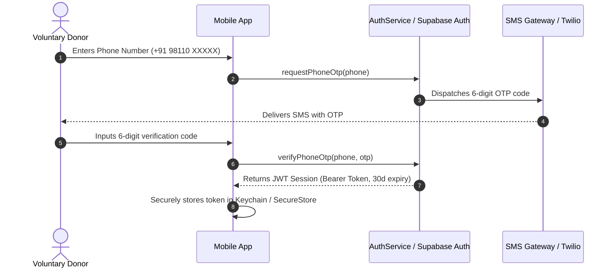
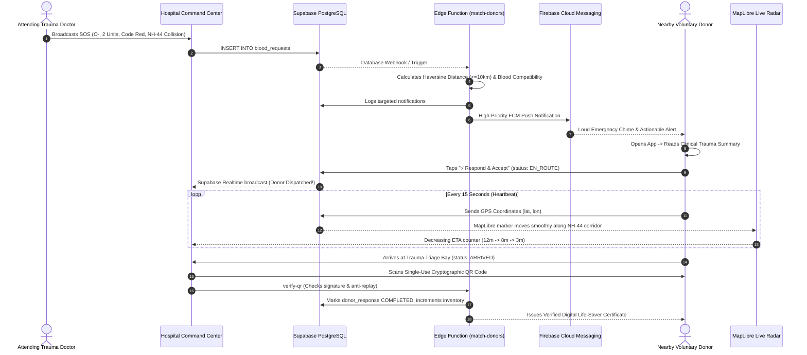

# BLOODLINK 8 — MASTER BACKEND & SYSTEM ARCHITECTURE
> **Tagline:** "8 Blood Groups. One Lifeline."  
> **Core Philosophy:** "The donor is a lifesaver volunteering to save someone. The emotional experience must feel calm, trustworthy, and urgent."

---

## 1. Complete Folder Structure

### 1.1 Mobile Application (React Native / Expo)
```
bloodlink8-mobile/
├── app/                              # Expo Router / Navigation screens
│   ├── (auth)/                       # Authentication Stack
│   │   ├── login.tsx                 # Phone Number Input UI
│   │   ├── otp-verify.tsx            # 6-Digit OTP verification
│   │   └── register.tsx              # Medical profile & eligibility details
│   ├── (tabs)/                       # Authenticated Main App Tabs
│   │   ├── index.tsx                 # Donor Home Dashboard & Availability Switch
│   │   ├── emergency.tsx             # Active SOS Alerts Feed
│   │   ├── history.tsx               # Donation History & Life-Saver Certificates
│   │   └── profile.tsx               # Medical Health Record & Blood Group ID
│   ├── emergency/
│   │   ├── [id].tsx                  # Emergency Details & Clinical Notes
│   │   ├── navigation.tsx            # Live Turn-by-Turn MapLibre GPS Navigation
│   │   └── qr-pass.tsx               # Cryptographic Single-Use QR Pass
│   └── _layout.tsx                   # Global Root Layout & Font Initialization
├── components/                       # Modular UI Components (Atomic Design)
│   ├── blood/                        # Blood Group Badges & Compatibility Indicators
│   ├── map/                          # MapLibre Map Canvas & Live Radar Pulses
│   ├── cards/                        # Apple Health Style Rounded Cards (28px radius)
│   └── common/                       # Buttons, Modals, Audio Chimes, Confetti
├── services/                         # Core API & Telemetry Layer
│   ├── supabaseClient.ts             # Supabase Client & Realtime Subscription
│   ├── authService.ts                # Phone OTP & Token Persistence
│   ├── locationService.ts            # 15s Background GPS Heartbeat (Expo Location)
│   ├── notificationService.ts        # FCM Push Notification Handlers
│   └── qrCertificateService.ts       # QR Generation & Offline Token Storage
├── hooks/                            # Custom React Hooks
│   ├── useEmergencySos.ts            # Realtime active SOS listener
│   ├── useLiveLocation.ts            # GPS watcher with accuracy filtering
│   └── useDonorEligibility.ts        # NBTC 90-day cooldown & hemoglobin validator
├── constants/                        # Theme, Blood Compatibility Matrix, Endpoints
├── types/                            # TypeScript Data Contracts
└── assets/                           # Audio chimes, official SVG seals, vector icons
```

### 1.2 Web Command Center (Next.js 15 / React 19)
```
bloodlink8-web/
├── src/
│   ├── app/                          # Next.js App Router Pages & API routes
│   │   ├── api/                      # Full-stack Server API Handlers
│   │   │   ├── match-donors/route.ts # Geofence + Compatibility calculation
│   │   │   ├── send-fcm/route.ts     # Firebase Cloud Messaging v1 dispatcher
│   │   │   └── verify-qr/route.ts    # Triage QR anti-replay & certificate issuance
│   │   ├── dashboard/                # Live Command Center Dashboard
│   │   ├── live-map/                 # Radar MapLibre GL JS Realtime Screen
│   │   ├── inventory/                # Cold-Vault 8 Blood Group Reserves
│   │   └── history/                  # Searchable Ledger of Issued Certificates
│   ├── components/
│   │   ├── common/                   # Header, Sidebar, Badges, Modals
│   │   ├── dashboard/                # Metric Cards, Response Timelines
│   │   └── pages/                    # 10 Command Center Workspaces
│   ├── context/                      # Global Command Center State & Device Mesh
│   ├── services/                     # TypeScript API Service layer
│   ├── data/                         # Mock Data & 10-Hospital Panipat Corridor Dataset
│   └── types.ts                      # Universal TypeScript Interfaces
├── supabase/
│   ├── schema.sql                    # Full PostgreSQL Tables, Constraints & Indexes
│   ├── policies.sql                  # Row Level Security (RLS) Data Protection
│   └── functions/                    # Deno / TypeScript Edge Functions
│       ├── match-donors/             # Spatial Haversine donor lookup
│       ├── send-fcm/                 # FCM Push dispatcher
│       └── verify-qr/                # Single-use triage validation
```

---

## 2. PostgreSQL Database Schema (Supabase)

### 2.1 Entity Relationship Model
- **`hospitals`**: Verified healthcare nodes authorized to trigger emergency broadcasts.
- **`donors`**: Registered voluntary life-savers with verified health credentials.
- **`blood_requests`**: Emergency SOS broadcasts containing required blood group, units, priority, and ward.
- **`donor_response`**: Live telemetry linking donors to emergencies with real-time GPS heartbeat and ETA.
- **`blood_inventory`**: Real-time units across all 8 blood groups per hospital with 48h expiry tracking.
- **`donation_history`**: Immutable ledger of completed life-saving donations with digital certificate hashes.
- **`notifications`**: Audit trail of dispatched FCM notifications.

### 2.2 Table Definitions & Indexes
Refer to `/supabase/schema.sql` for the full DDL. Key indexes include:
- `idx_donors_composite_match`: Multi-column index on `(blood_group, availability, verified, latitude, longitude)` for sub-millisecond geofence queries.
- `idx_donor_response_qr`: Unique index on `qr_token` enforcing single-use anti-replay validation.
- `idx_blood_requests_status`: Index on active states (`BROADCASTING`, `DONORS_DISPATCHED`).

---

## 3. Row Level Security (RLS) Policies

All tables have RLS enabled (`ALTER TABLE ... ENABLE ROW LEVEL SECURITY`).
Refer to `/supabase/policies.sql` for complete SQL statements.

| Table | Policy | Allowed Roles | Enforcement Mechanism |
|---|---|---|---|
| `donors` | `donor_select_own` | Donor (`auth.uid() = donor_id`) | Users can only view their own profile. |
| `donors` | `hospital_view_masked` | Hospital | Live phone & personal address are masked until donor accepts SOS. |
| `hospitals` | `hospital_public_select` | Authenticated | Only verified hospitals (`verified = TRUE`) are visible. |
| `blood_requests` | `hospital_insert_sos` | Verified Hospital | Only verified nodes with valid medical licenses can trigger SOS. |
| `donor_response` | `hospital_view_assigned` | Requesting Hospital | Hospital only sees GPS of donors who accepted that hospital's request. |
| `donation_history` | `public_verify_certificate` | Public Read | Verifies certificate legitimacy via `certificate_number` and hash. |

---

## 4. Authentication Flow

### 4.1 Donor Authentication (Phone OTP)


### 4.2 Hospital Authentication (License-Verified Account)
Hospitals authenticate with Email + Password, cross-referenced with their State Blood Transfusion Council license number (`nabhLicense`). Only accounts marked `verified = TRUE` have permission to trigger `CODE_RED` broadcasts.

---

## 5. Live Emergency Flow (Sequence Diagram)



---

## 6. Blood Compatibility Matrix

Medical rules enforced in both the Edge Function (`match-donors`) and client services:

| Recipient Blood Group | Compatible Donors (Who can donate?) |
|---|---|
| **O-** | **O- ONLY** (Most critical shortage group) |
| **O+** | O-, O+ |
| **A-** | O-, A- |
| **A+** | O-, O+, A-, A+ |
| **B-** | O-, B- |
| **B+** | O-, O+, B-, B+ |
| **AB-** | O-, A-, B-, AB- |
| **AB+** | **ALL 8 Blood Groups** (Universal Recipient) |

---

## 7. Geofencing & Haversine Distance

The Haversine formula determines the great-circle distance between two points on a sphere:
$$\Delta\sigma = 2 \arcsin \left( \sqrt{\sin^2\left(\frac{\Delta\phi}{2}\right) + \cos(\phi_1)\cos(\phi_2)\sin^2\left(\frac{\Delta\lambda}{2}\right)} \right)$$
$$d = R \cdot \Delta\sigma$$

- **Radius Options:** 5 km, 10 km (default for urban trauma), 20 km (highway corridors).
- **Traffic-Weighted ETA:** Adjusts travel time based on vehicle type (Bike: 30 km/h, Car: 22 km/h, Metro: 15 km/h) plus a 3-minute emergency dispatch buffer.

---

## 8. High-Priority FCM Push Notification Specification

FCM HTTP v1 Standard Payload:
```json
{
  "message": {
    "topic": "emergency_blood_o_neg_panipat",
    "notification": {
      "title": "🚨 CODE RED: O- Blood Needed Urgently!",
      "body": "Verified Emergency Network Node (OT-1) requires immediate donor dispatch. 2.4 km away. Tap to accept."
    },
    "android": {
      "priority": "high",
      "notification": {
        "channel_id": "emergency_blood_alerts_v1",
        "sound": "emergency_alarm_chime",
        "visibility": "public"
      }
    },
    "data": {
      "requestId": "REQ-2026-0891",
      "bloodGroup": "O-",
      "hospitalName": "Verified Emergency Network Node",
      "distanceKm": "2.4",
      "etaMinutes": "8",
      "priority": "CODE_RED",
      "deepLink": "bloodlink://emergency/REQ-2026-0891"
    }
  }
}
```

---

## 9. Single-Use QR & Verifiable Digital Certificate

1. **Generation:** When a donor accepts, a time-limited token is minted:
   $$\text{Signature} = \text{HMAC-SHA256}(\text{requestId} \parallel \text{donorId} \parallel \text{bloodGroup} \parallel \text{timestamp})$$
2. **Verification & Anti-Replay:** When scanned at hospital triage, `qr_scanned` is toggled to `TRUE`. Subsequent scan attempts are rejected with HTTP 409 Conflict.
3. **Certificate Ledger:** A permanent row is created in `donation_history` containing the hospital name, doctor on duty, units, timestamp, and a public SHA-256 verification hash.

---

## 10. Hackathon Demo Mode ("Simulate Highway Accident")

A 1-click automated 90-second scenario built directly into the interface:
- **00:00** — Attending doctor creates emergency Code Red O- request: "Mass Casualty: NH-44 GT Road Multi-Vehicle Collision at Panipat Toll".
- **00:05** — 3 nearby donors alerted via high-priority FCM notifications.
- **00:12** — 2 donors accept dispatch and begin live navigation.
- **00:28** — Real-time GPS radar heartbeat updates distance and ETA on MapLibre.
- **00:55** — First donor arrives at emergency triage bay.
- **01:12** — Single-use cryptographic QR code scanned and verified.
- **01:28** — Transfusion units incremented, digital certificate generated, and SOS stood down.
- **Controls:** Play, Pause, Speed up (1x, 3x, 10x), Reset, and Jump to Radar Map.
